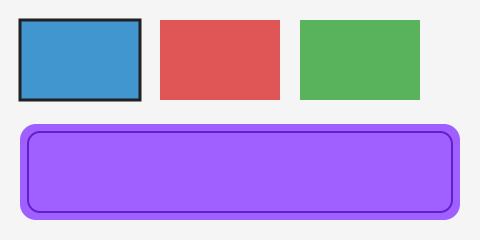
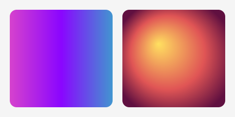
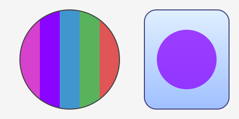
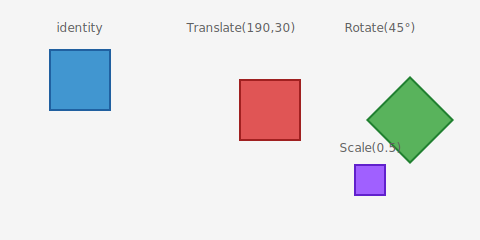

# Canvas API

The Xui Canvas API is modeled after the [HTML5 Canvas 2D Context API](https://developer.mozilla.org/en-US/docs/Web/API/CanvasRenderingContext2D).
If you know the browser API, you already know most of Xui's drawing primitives.

`IContext` is the aggregate interface. You receive it in `View.RenderCore`:

```csharp
protected override void RenderCore(IContext context)
{
    // draw here
}
```

## Fill and stroke styles

Set fill or stroke before drawing. Styles are **ref struct** values — no boxing.

```csharp
// Solid color
context.SetFill(Colors.CornflowerBlue);
context.SetStroke(new Color(0xFF, 0x00, 0x00, 0xFF));

// Linear gradient
context.SetFill(new LinearGradient(
    start:    new Point(0, 0),
    end:      new Point(300, 0),
    gradient: [new(0f, Colors.Purple), new(1f, Colors.Cyan)]));

// Image pattern (equivalent to ctx.createPattern in browser)
IImage img = this.GetService<IImage>();
img.Load("Assets/tile.png");
context.SetFill(new ImagePattern(img, PatternRepeat.Repeat));
```

## Rectangles

Rounded rectangles use a path + fill/stroke cycle:

```csharp
context.FillRect(new Rect(10, 10, 200, 100));
context.StrokeRect(new Rect(10, 10, 200, 100));

context.BeginPath();
context.RoundRect(new Rect(10, 130, 200, 80), cornerRadius: 16);
context.Fill(FillRule.NonZero);
```



## Paths

Build a path with `BeginPath`, add segments, then call `Fill` and/or `Stroke`.

```csharp
context.BeginPath();
context.MoveTo(new Point(50, 50));
context.LineTo(new Point(150, 50));
context.LineTo(new Point(100, 120));
context.ClosePath();
context.Fill(FillRule.EvenOdd);
context.Stroke();
```

Curves:
```csharp
context.CurveTo(cp1, cp2, to);          // cubic Bézier
context.CurveTo(cp1, to);               // quadratic Bézier
context.Arc(center, radius, startAngle, endAngle, Winding.Clockwise);
context.ArcTo(cp1, cp2, radius);
context.Ellipse(center, rx, ry, rotation, startAngle, endAngle, winding);
context.RoundRect(rect, cornerRadius);
```


## Gradients

Gradients are ref structs — constructed inline, no allocation.

```csharp
context.SetFill(new LinearGradient(
    start:    new Point(0, 0),
    end:      new Point(300, 0),
    gradient: [new(0f, Colors.DeepPink), new(1f, Colors.Blue)]));

context.SetFill(new RadialGradient(
    startCenter:   new Point(150, 100),
    startRadius:   0,
    endCenter:     new Point(150, 100),
    endRadius:     120,
    gradientStops: [new(0f, Colors.Yellow), new(1f, Colors.Red)]));
```



## Clipping

`Clip()` restricts drawing to the current path. `Save`/`Restore` scope the clip.

```csharp
context.Save();

context.BeginPath();
context.Arc(center, radius, 0, 2 * NFloat.Pi, Winding.ClockWise);
context.Clip();                 // all subsequent draws masked to circle

// ... draw inside the circle ...

context.Restore();              // clip released
```



## Transforms

All transforms compose on the current matrix. `Save`/`Restore` stack them.

```csharp
context.Save();
context.Translate((100, 50));
context.Rotate(NFloat.Pi / 4);
context.Scale((2f, 2f));
// ... draw ...
context.Restore();
```



## Images

```csharp
context.DrawImage(image, destRect);
context.DrawImage(image, destRect, opacity);
context.DrawImage(image, sourceRect, destRect, opacity);
```

See [Image Loading](images.md) for how to acquire and load `IImage` handles.

## Line style

```csharp
context.LineWidth   = 2f;
context.LineCap     = LineCap.Round;
context.LineJoin    = LineJoin.Round;
context.MiterLimit  = 10f;
context.SetLineDash([8f, 4f]);          // ReadOnlySpan<nfloat>
context.LineDashOffset = 2f;
```

## Text

```csharp
context.SetFont(new Font(16, ["Inter"], FontWeight.Normal));
context.TextAlign    = TextAlign.Left;
context.TextBaseline = TextBaseline.Alphabetic;
context.SetFill(Colors.Black);
context.FillText("Hello", new Point(20, 40));

var metrics = context.MeasureText("Hello");
```

## Sub-interfaces

`IContext` is composed of these sub-interfaces — useful for narrowing what a helper method needs:

| Interface | Responsibility |
|---|---|
| `IPenContext` | Fill/stroke styles, line width, dash, caps/joins |
| `IPathBuilder` | `BeginPath`, `MoveTo`, `LineTo`, `CurveTo`, `Arc`, `ClosePath` |
| `IPathDrawing` | `Fill`, `Stroke` |
| `IPathClipping` | `Clip` |
| `IRectDrawingContext` | `FillRect`, `StrokeRect`, `ClearRect` |
| `IImageDrawingContext` | `DrawImage` overloads |
| `ITextDrawingContext` | `FillText` |
| `ITextMeasureContext` | `MeasureText`, `SetFont` |
| `ITransformContext` | `Translate`, `Rotate`, `Scale`, `SetTransform`, `Transform` |
| `IStateContext` | `Save`, `Restore` |
